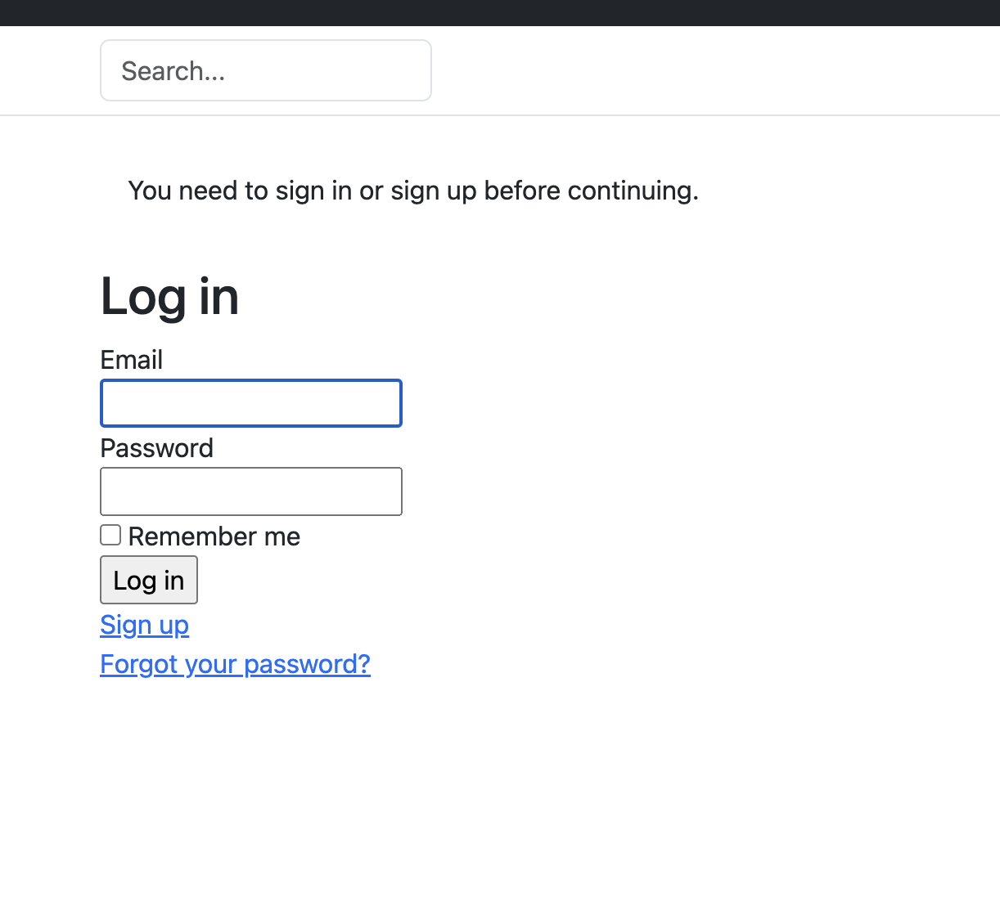
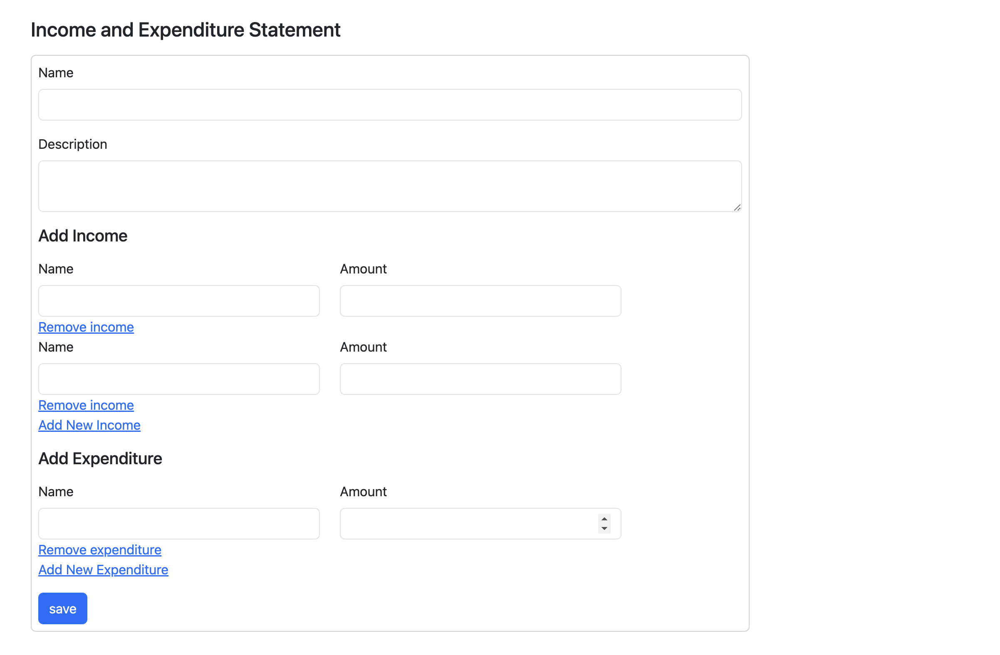
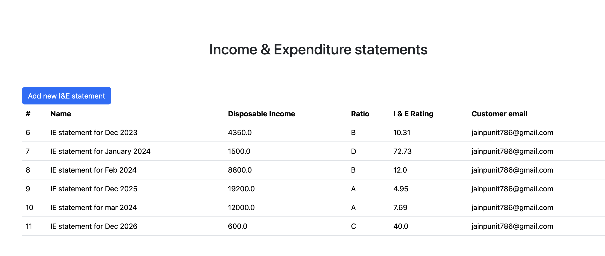

# README

##  About

This is a simple rails app that allows users to track their income and expenditure.

##  Setup
1. Clone the repo
2. Run `bundle install`
3. I am using SQL lite so may need to install some dependencies if not installed.
4. Run `rails db:create`
5. Run `rails db:migrate`
6. Run `rails db:seed` or create a user by signing up manually.
7. Run `rails s` to start the server
8. Visit `localhost:3000` to view the app.
9. Login with the credentials provided in the seed file or with the signed up user.

##  Features

1. User can sign up and login.

2. User can add multiple incomes and expenditures.
   

3. User can view their IE ratings and disposable income.
   

## Approach
1. I started by creating the rails app and setting up the models.
2. I have then created the Investment statement model and the user model.
3. Created separate models for income and expenditure although they have same fields. 
4. My thought was that they are same but it just reduce the complexity having them different in calculations and validations if needed.
5. Add some validations to the models.
6. Created the basic controllers and views for creating and viewing the investment statements.
7. Use nested attributes to create income and expenditure in the investment statement form.
8. Added some basic styling to the views using bootstrap boiler plate code.
9. Added some basic tests for the models and controllers.
10. Added some basic seed data to test the app.
11. Add readme file.
12. Done some refactoring and clean up.
13. Add devise gem for authentication and do some refactoring around it.

##  Future Improvements
If I have more time then I would like to do the following:
1. I would like to add some more views to show the income and expenditure as separate pages to show all the incomes and expenses.
2. Some more clean up and refactoring so move some of the logic and reuse them.
3. I have added tests only for one model and one controller given the time constraint. I would like to add more tests to cover all the models and controllers.